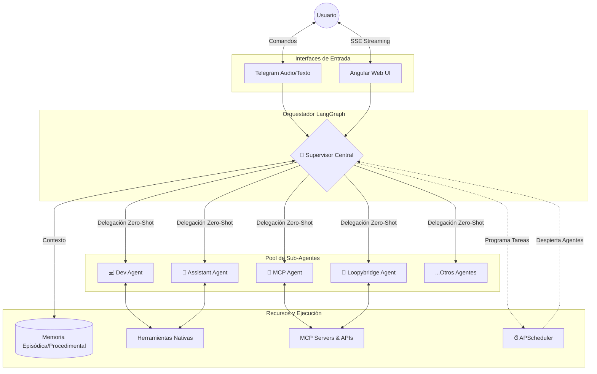
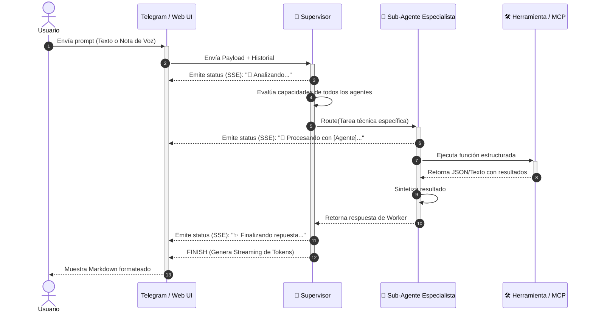

# Leygo 🤖

Un asistente de Inteligencia Artificial personal, autónomo y **auto-extensible**, diseñado para integrarse profundamente con tu flujo de trabajo diario. Este proyecto actúa como un "Cerebro Central" jerárquico capaz de interactuar con múltiples plataformas, ejecutar tareas recurrentes, aprender de sus interacciones y **programar sus propios sub-agentes especializados** en tiempo real.

---

## 🏗️ Arquitectura del Sistema Multi-Agente

Inspirado en ecosistemas cognitivos, Leygo utiliza **LangGraph** para orquestar un esquema de delegación basado en grafos. El Supervisor actúa como enrutador inteligente y deriva el trabajo semánticamente.



### 🔄 Flujo de Resolución de Tareas

A continuación se detalla cómo el sistema resuelve un _prompt_ delegándolo asíncronamente:



---

## ✨ Características Principales

### 🧠 Supervisor y Hot-Reload (LangGraph)
*   **Supervisor Central:** Orquestador inteligente que evalúa el historial completo y delega tareas a sub-agentes mediante la herramienta estructurada `Route`. 
*   **Auto-Discovery & Hot-Reload:** El sistema detecta nuevos sub-agentes en la carpeta `sub_agents/` creados por el AutoCoder y recompila el grafo dinámicamente sin reiniciar el bot.
*   **Anti-Alucinaciones:** Restricciones sistémicas a nivel `bind_tools` previniendo loops infinitos y forzando delegaciones seguras.

### ⏰ Ejecución Autónoma en Diferido (APScheduler)
*   **Rutinas Dinámicas:** Capacidad de agendar recordatorios o rutinas lógicas generativas (cron, intervalos o fechas).
*   **Acciones de Agente Programadas:** El usuario puede pedir agendar _"revisa un archivo en 10 minutos y mándalo por email"_. El orquestador despierta en background e inyecta la tarea sin interacción manual, respetando estrictamente zonas horarias (`Timezone-Aware`).

### 🔌 Model Context Protocol (MCP) y Puentes
*   **MCP Agent:** Conectividad robusta con repositorios, bases de datos (Postgres), APIs (Slack, GitHub) inyectadas dinámicamente vía especificación JSON-RPC de Anthropic.
*   **Loopybridge Agent:** Interconexión remota en tiempo real mediante tokens *Bearer* con ecosistemas de agentes externos (ej. Loopy Thinking).

### 💾 Sistema de Memoria Segmentada y Aislada
*   **Memoria Episódica:** Contextos conversacionales a largo plazo y preferencias crónicas del usuario inyectados como base.
*   **Memoria Procedimental:** Catálogo histórico de lecciones técnicas, errores solucionados, herramientas y guías operativas. El Supervisor inyecta solo la sub-carpeta de memoria del agente activado, previniendo sobredilución del contexto.

### 💻 Auto-Coder & Editor Web IDE
*   El **Dev Agent** tiene la capacidad de crear, probar localmente y desplegar permanentemente nuevas herramientas y sub-agentes.
*   **Leygo GUI (Angular 17+):** Una interfaz web robusta con editor de código IDE full-screen integrado. Permite gestionar variables locales (`.env`) por agente, sobreescribir sus instrucciones en línea y visualizar el historial de costos (Budget Limiter) detallado mediante métricas interactivas.

---

## 🚀 Estructura de Proyecto

```text
self-agent/
├── agent_core/
│   ├── main.py                 # Orquestador: Supervisor LangGraph y Routing
│   ├── scheduler_manager.py    # Motor asíncrono avanzado de recordatorios
│   ├── api_endpoints.py        # API REST FastAPI + Server-Sent Events (SSE)
│   ├── sub_agents/             # 🧠 Sub-Agentes Independientes (Escalables)
│   ├── memoria/                # 📁 Almacenamiento JSON/MD y Costos Históricos
│   └── keys/                   # Autenticaciones de Google OAuth2 (token.pickle)
├── leygo-gui/                  # 💻 Frontend App en Angular/Node
├── docker-compose.yml          # Topología general
└── deploy.sh                   # Script seguro de actualización y backup en caliente
```

---

## ⚙️ Instalación y Despliegue (Docker)

La arquitectura de Leygo funciona eficientemente dentro de un entorno vectorizado en Docker para evitar colisiones de dependencias entre el Frontend GUI y los procesos interactivos de Python.

1.  **Clonar repositorio y preparar variables de entorno principales:**
    Crea un archivo `.env` base en `agent_core/.env`:
    ```env
    GOOGLE_API_KEY="tu_api_key_gemini"
    TELEGRAM_TOKEN="tu_token_bot"
    TELEGRAM_CHAT_ID="tu_id_numerico_principal"
    MODEL_SUPERVISOR="gemini-2.5-flash"
    MONTHLY_BUDGET_USD="5.0"
    ```

2.  **Construir e iniciar contenedores:**
    ```bash
    docker-compose up -d --build
    ```

3.  **Monitoreo del Agente y Logs de Flujo:**
    Sigue el proceso de inicialización, handshake MCP y delegaciones LangGraph en crudo:
    ```bash
    docker logs -f leygo-bot
    ```

---

*Hecho por @JesusMaster para redefinir el estándar de agentes IA productivos en entornos cerrados.*
